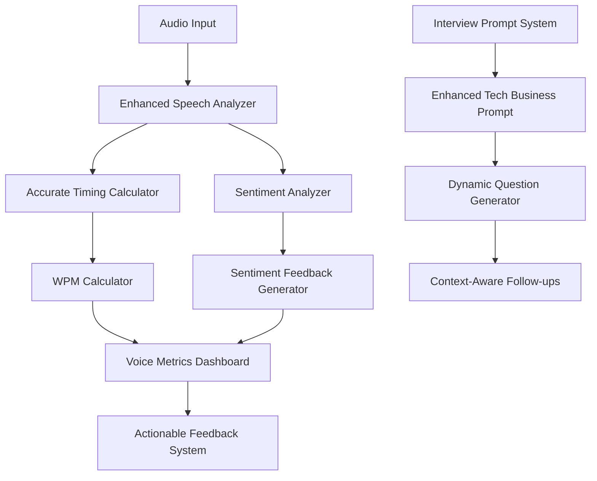

# Design Document

## Overview

This design addresses three critical improvements to the voice analysis system: fixing the inaccurate WPM calculation that consistently defaults to around 60 WPM, enhancing sentiment analysis with actionable feedback integration, and improving the tech business interview prompt performance. The solution involves refactoring the speech analysis pipeline, integrating sentiment feedback into the existing feedback system, and enhancing the interview prompt structure.

## Architecture

### Current System Analysis

The current voice analysis system has several components:
- `speechAnalysis.ts` - Main voice metrics calculation
- `openai.ts` - Alternative WPM calculation with clamping
- `FocusedInterviewResults.tsx` - Feedback display component
- Individual prompt system in `src/individualprompts/`

### Proposed Architecture Changes



## Components and Interfaces

### 1. Enhanced Speech Analysis Engine

**Location:** `src/utils/speechAnalysis.ts`

**Key Interfaces:**
```typescript
interface EnhancedVoiceMetrics extends VoiceMetrics {
  actualSpeechDuration: number;
  silenceDuration: number;
  segmentTimings: Array<{start: number, end: number, wordCount: number}>;
  sentimentScore: number;
  sentimentFeedback: SentimentFeedback;
  timingAccuracy: number;
}

interface SentimentFeedback {
  score: number; // -1 to 1
  category: 'very_positive' | 'positive' | 'neutral' | 'negative' | 'very_negative';
  actionableTips: string[];
  strengths: string[];
  improvements: string[];
}

interface TimingData {
  speechSegments: Array<{start: number, end: number}>;
  totalSpeechDuration: number;
  totalSilenceDuration: number;
  processingLatency: number;
}
```

### 2. Accurate WPM Calculator

**New Component:** `src/utils/accurateWpmCalculator.ts`

**Responsibilities:**
- Precise timing measurement excluding silence periods
- Word count validation against transcription
- Edge case handling for very short/long segments
- Cumulative WPM calculation across multiple segments

**Key Methods:**
```typescript
class AccurateWpmCalculator {
  calculateSegmentWpm(wordCount: number, speechDuration: number): number;
  calculateCumulativeWpm(segments: SpeechSegment[]): number;
  validateTiming(audioData: AudioBuffer, transcription: string): TimingData;
  handleEdgeCases(duration: number, wordCount: number): number;
}
```

### 3. Enhanced Sentiment Analysis

**Enhanced Component:** `src/utils/sentimentAnalyzer.ts`

**Responsibilities:**
- Real-time sentiment scoring using existing Sentiment library
- Context-aware feedback generation
- Integration with voice confidence metrics
- Actionable tip generation based on sentiment patterns

**Key Methods:**
```typescript
class EnhancedSentimentAnalyzer {
  analyzeSentiment(transcription: string): SentimentAnalysis;
  generateActionableFeedback(sentiment: SentimentAnalysis, context: string): SentimentFeedback;
  integrateSentimentWithVoiceMetrics(sentiment: SentimentAnalysis, voiceMetrics: VoiceMetrics): EnhancedVoiceMetrics;
}
```

### 4. Tech Business Interview Prompt Enhancement

**Enhanced Component:** `src/individualprompts/technology/business-analyst.ts`

**Improvements:**
- More dynamic question progression
- Industry-specific scenarios
- Better follow-up question logic
- Realistic business case simulations

## Data Models

### Enhanced Voice Metrics Model

```typescript
interface EnhancedVoiceMetrics {
  // Existing metrics
  speechRate: number;
  fluencyScore: number;
  voiceConfidence: number;
  deliveryScore: number;
  clarityScore: number;
  fillerWordCount: number;
  
  // Enhanced timing data
  actualSpeechDuration: number;
  silenceDuration: number;
  timingAccuracy: number;
  segmentCount: number;
  
  // Sentiment analysis
  sentimentScore: number;
  sentimentCategory: string;
  emotionalTone: string;
  
  // Metadata
  timestamp: number;
  duration: number;
  processingLatency: number;
}
```

### Sentiment Feedback Model

```typescript
interface SentimentFeedback {
  overall: string;
  score: number;
  category: 'very_positive' | 'positive' | 'neutral' | 'negative' | 'very_negative';
  strengths: string[];
  improvements: string[];
  actionableTips: string[];
  emotionalTrends: Array<{
    timestamp: number;
    sentiment: number;
    context: string;
  }>;
}
```

## Error Handling

### WPM Calculation Error Handling

1. **Invalid Duration Handling:**
   - If duration < 0.5 seconds: Use transcription-based estimation
   - If duration > 300 seconds: Validate against expected speech patterns
   - If audio processing fails: Fall back to text-based timing estimation

2. **Word Count Validation:**
   - Cross-validate transcription word count with audio analysis
   - Handle empty or very short transcriptions gracefully
   - Provide confidence scores for WPM calculations

3. **Timing Accuracy Validation:**
   - Compare calculated WPM against expected ranges (80-250 WPM)
   - Flag suspicious calculations for manual review
   - Provide fallback calculations when primary method fails

### Sentiment Analysis Error Handling

1. **Library Failures:**
   - Graceful degradation when Sentiment library fails
   - Fallback to keyword-based sentiment analysis
   - Maintain other voice metrics when sentiment fails

2. **Invalid Input Handling:**
   - Handle empty or very short transcriptions
   - Process non-English text appropriately
   - Validate sentiment scores within expected ranges

## Testing Strategy

### Unit Testing

1. **WPM Calculator Tests:**
   - Test with known audio samples and expected WPM values
   - Validate edge cases (very fast/slow speech, silence periods)
   - Test timing accuracy with synthetic audio data

2. **Sentiment Analysis Tests:**
   - Test with sample transcriptions of known sentiment
   - Validate feedback generation for different sentiment ranges
   - Test integration with existing voice metrics

3. **Integration Tests:**
   - End-to-end testing with real interview audio
   - Validate feedback display in UI components
   - Test real-time metric updates

### Performance Testing

1. **Real-time Processing:**
   - Ensure voice metrics update within 2 seconds
   - Test with varying audio quality and length
   - Validate memory usage during long interviews

2. **Accuracy Validation:**
   - Compare calculated WPM with manual timing measurements
   - Validate sentiment analysis against human evaluators
   - Test consistency across multiple users and scenarios

### User Acceptance Testing

1. **Interview Simulation:**
   - Test with actual users conducting mock interviews
   - Validate that WPM calculations reflect actual speaking pace
   - Ensure sentiment feedback is helpful and accurate

2. **Feedback Quality:**
   - Verify actionable tips are specific and helpful
   - Test feedback integration in existing UI components
   - Validate that metrics help users improve their performance

## Implementation Phases

### Phase 1: WPM Calculation Fix
- Refactor timing calculation logic
- Implement accurate speech duration measurement
- Add edge case handling and validation
- Update existing WPM display components

### Phase 2: Sentiment Analysis Enhancement
- Enhance sentiment scoring with actionable feedback
- Integrate sentiment feedback into existing feedback system
- Add sentiment metrics to voice timeline
- Update UI components to display sentiment data

### Phase 3: Interview Prompt Improvement
- Enhance tech business interview prompt
- Improve question progression and follow-up logic
- Add industry-specific scenarios and contexts
- Test and validate improved interview quality

### Phase 4: Integration and Testing
- Integrate all components into unified system
- Comprehensive testing and validation
- Performance optimization
- User acceptance testing and feedback incorporation