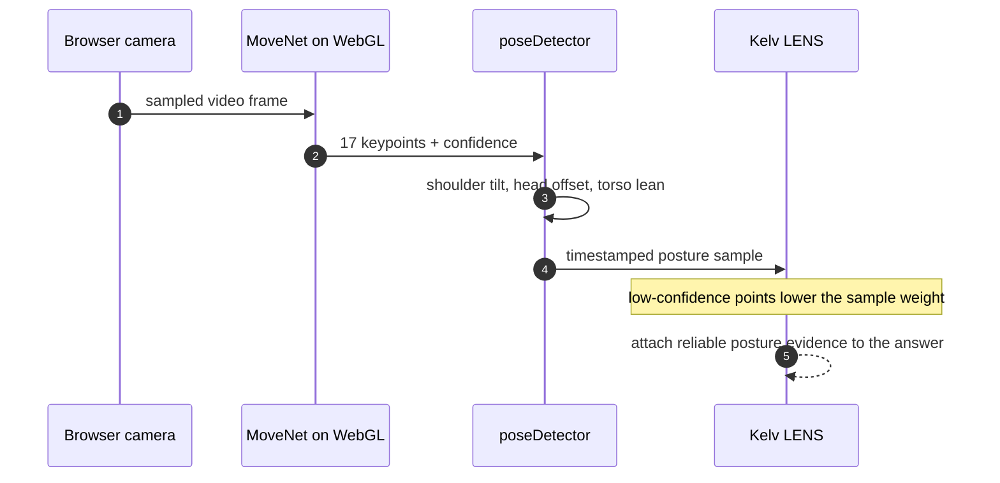

<p align="center"></p>

<h1 align="center">Kelv AI</h1>

<p align="center"><strong>Browser-based interview practice that turns a live conversation into per-question feedback on content, delivery, and posture.</strong></p>

<p align="center">
  <a href="https://www.youtube.com/watch?v=sv-mgria_6Q">Watch the demo</a>
  &middot;
  <a href="#run-locally">Run locally</a>
  &middot;
  <a href="#how-it-works">How it works</a>
  &middot;
  <a href="#the-signal-pipeline">Pipeline</a>
</p>

<p align="center">
  
  
  
  
  
  
</p>

> [!NOTE]
> Kelv started as a senior-year capstone built by my friends and me. Before we thought about open-sourcing it, it had roughly **300 people on the waitlist**.

## What it is

Most interview prep hands you a question list or generic feedback after the fact. Kelv makes the practice session itself the product: it runs a real conversation, keeps the evidence attached to each answer, and tells you the one thing to fix next.

It runs entirely in the browser. There is no backend, no database, and no login.

- **ElevenLabs Agents** drives the live interviewer over a WebRTC voice connection.
- The browser captures webcam and microphone with the user's permission and analyzes both **on-device**.
- Kelv assembles a local `SessionResultV2`: per-question scores, the signals behind them, a reliability estimate, and one concrete drill for the next rep.

> [!IMPORTANT]
> **Browser-first is a deliberate tradeoff.** Interview video and audio are personal, and a capstone didn't need a database to prove the feedback loop. The cost: saved sessions live in `localStorage` on the browser profile that created them, so they don't follow you across devices.

## Product

### Dashboard

`/platform` opens directly in local mode, with no hosted login, Supabase project, or row-level-security setup to try it.


### Setup

Before the interview, the user adds job context and grants camera/microphone access. The same browser tab owns the capture stream and the local recovery state for the session.


### Review

The review keeps the question, the answer, the signal quality, and the coaching in one place, so a weak score is traceable to the evidence that produced it.


## How it works


Three signal streams run in parallel inside the browser and converge on a single question/answer timeline:

| Stream | Source | Extracts |
| --- | --- | --- |
| **Vision** | Webcam frames → MoveNet | shoulder alignment, head position, torso lean |
| **Voice** | Local WebM recording → Web Audio | speech rate, pauses, energy, pitch, spectrum |
| **Content** | ElevenLabs transcript events | answer boundaries, filler terms, STAR structure |

A fusion step called **Kelv LENS** aligns all three to each answer, weights them by how trustworthy the capture was, and emits scores plus one coaching target.

## The signal pipeline

### Vision: posture from pose landmarks



Pose runs on **MoveNet SinglePose Lightning** (`@tensorflow-models/pose-detection`) on the TensorFlow.js WebGL backend, so no frames ever leave the machine. Each inference returns 17 keypoints normalized to `0–1` with a confidence score.

`poseDetector.ts` doesn't score the image. It reduces the keypoints to geometry:

- **Shoulder alignment:** `atan2` of the shoulder vector; a level line scores 100, and the score falls off linearly to 0 at an 18° tilt.
- **Head position:** classified `centered` / `forward` / `tilted` from ear-line tilt, horizontal head offset relative to shoulder width, and torso lean.
- **Confidence gate:** keypoints below `0.3` confidence are treated as unreliable, and a frame with weak shoulders returns a neutral sample instead of a confident-but-wrong one.

`usePoseTracking` samples these on an interval and timestamps each one so LENS can line them up with the answer that was being spoken.

### Voice: prosody from the raw waveform


Delivery is measured on two lanes that meet on the same time range.

**Audio lane.** The `MediaRecorder` capture (`video/webm`, VP8/VP9 + Opus) is decoded with `AudioContext.decodeAudioData`, then `enhancedSpeech.ts` runs a windowed feature pass (16 kHz, a 1024-sample window with 512-sample hop) and computes RMS energy, zero-crossing rate, autocorrelation pitch (80–800 Hz), spectral centroid, and 13 MFCC-style coefficients. Those roll up into speech rate, fluency, clarity, and voice-stability scores. If a browser can't decode the blob, it falls back to transcript-only metrics and flags the answer as lower confidence.

**Transcript lane.** ElevenLabs conversation events tell Kelv what was said and when. That's what marks the start and end of each answer, counts filler terms, and keeps one answer's delivery from bleeding into the next question.

A long pause only becomes feedback once Kelv knows *which* answer it landed in and whether the recording was clean enough to trust.

### Fusion: Kelv LENS

`kelvLens.ts` (`buildKelvLensSignals`, engine `kelv-lens-v1.0.0`) is a reliability-aware fusion step, not a model that guesses whether someone is employable.

- **Voice confidence** is a weighted blend of pace, filler control, pause control, articulation, fluency, and vocal variety.
- **Vision confidence** blends posture score, shoulder alignment, head centering, visual stability, and sample coverage.
- **Delivery-presence** fuses the two (`voice × 0.62 + vision × 0.38`), then scales the result by the session's reliability weight and pulls the remainder toward a conservative baseline, so a noisy capture reports a hedged score rather than a confident wrong one.
- It emits raw signals with **flags** (`pace_too_fast`, `high_filler_load`, `posture_drift`, `head_forward`, `no_pose_samples`, …) and turns the top flags into at most four concrete coaching lines.

### Reliability

`signalReliability.ts` runs alongside LENS. It scores content, delivery, and presence confidence separately, blends them (`0.45 / 0.35 / 0.20`), slices the session into 30-second windows, and raises reason flags (`short_transcript`, `short_utterance`, `tracking_loss`, …). Downstream, `applyReliabilityAdjustment` pulls low-confidence scores toward a neutral baseline. The design goal is that Kelv would rather say *"I couldn't see you clearly"* than invent a posture verdict from three bad frames.

## Output: `SessionResultV2`

Every session produces one typed, self-contained object (`kelv-session-v2.0.0`), assembled by `sessionResultAdapter.ts`, validated by `sessionResultValidation.ts`, and persisted to `localStorage`.

<details>
<summary>The shape (trimmed)</summary>

```ts
interface SessionResultV2 {
  transcript: { role: 'assistant' | 'user' | 'system'; content: string; timestamp: string }[];
  timing: { duration_sec: number; speaking_rate_wpm?: number; filler_word_count?: number };
  posture_summary?: {
    sample_count: number;
    overall_score: number;
    head_position: 'centered' | 'forward' | 'tilted';
    time_in_good_posture: number;
  };
  per_question_results: QuestionEvaluation[];      // content / delivery / presence + next_rep
  overall_scores: { content: number; delivery: number; presence: number; overall: number };
  recommended_drills: PracticePlan[];              // one weak point → one drill
  signal_reliability: SignalReliability;           // confidence + reason flags + windows
  signal_fusion?: VoiceCvSignalFusion;             // the LENS output
  processing_metadata: {
    pipeline_version: string;
    transcript_vendor: 'elevenlabs' | 'openai' | 'self_hosted_whisper' | 'hybrid' | 'vapi';
    used_fallback: boolean;
    reliability_flags: string[];
  };
}
```

</details>

## Built with

- **App:** React 18, TypeScript, Vite 5, Tailwind CSS, React Router 7
- **Voice interviewer:** ElevenLabs Agents (`@elevenlabs/react`)
- **Computer vision:** MoveNet via `@tensorflow-models/pose-detection` on `@tensorflow/tfjs-backend-webgl`
- **Audio DSP:** Web Audio API (`AudioContext`), custom feature extraction in `enhancedSpeech.ts`
- **UI:** Framer Motion, Chart.js, WaveSurfer.js, Lucide / Heroicons
- **Testing:** Vitest (unit) and Playwright (end-to-end)
- **Optional:** OpenAI SDK for a demo-only LLM feedback path

## Project structure

```
src/
  hooks/
    useElevenLabsInterview.ts   # live agent session + transcript events
    useInterviewRecorder.ts     # MediaRecorder capture (webm)
    usePoseTracking.ts          # MoveNet sampling loop
  utils/
    poseDetector.ts             # keypoints -> posture geometry
    enhancedSpeech.ts           # Web Audio feature extraction
    perQuestionAnalytics.ts     # answer segmentation + per-question metrics
    signalReliability.ts        # confidence + reason flags
    kelvLens.ts                 # voice + vision + content fusion
    sessionResultAdapter.ts     # assembles SessionResultV2
    sessionResultValidation.ts  # runtime schema guard
    openAIFeedback.ts           # optional, demo-only LLM feedback
  types/
    sessionResult.ts            # the data contract
  components/Platform/          # dashboard, session, results UI
scripts/
  dev.mjs                       # dev entry (optionally provisions the agent)
  setup-elevenlabs-agent.mjs    # creates the Kelv agent via the ElevenLabs API
e2e/                            # Playwright flows + README capture
```

## Run locally

**Prerequisites:** Node.js 20+, a Chromium-based browser, and an ElevenLabs Agent ID for the live voice interview.

```bash
npm install
cp .env.example .env
# set VITE_ELEVENLABS_AGENT_ID in .env
npm run dev
```

Then open **`http://localhost:5173/platform`**.

Don't have an agent yet? Add your `ELEVENLABS_API_KEY` to `.env` and run `npm run setup:elevenlabs-agent`. It provisions the Kelv agent through the ElevenLabs API (the `eleven_flash_v2` voice model is recommended for latency).

> [!WARNING]
> `VITE_OPENAI_API_KEY` enables an optional LLM feedback path and is **demo-only**. A `VITE_`-prefixed key is bundled into the client, so never ship one to production.

### Scripts

| Command | What it does |
| --- | --- |
| `npm run dev` | Start the local platform on port 5173. |
| `npm test` | Run the Vitest unit suite. |
| `npm run test:e2e` | Run the Playwright end-to-end flow. |
| `npm run test:prompts` | Test interviewer prompt and context composition. |
| `npm run capture:readme` | Regenerate the screenshots in this README. |
| `npm run setup:elevenlabs-agent` | Create the ElevenLabs agent. |

## Roadmap

A few things we wanted to try but couldn't fit in the capstone timeline:

- **More camera angles.** Pair the laptop camera with two external cameras and use cross-view agreement to cut down on occlusion errors.
- **Better audio.** Test an external or spectral microphone. Cleaner source audio makes the prosody and spectral features far more stable than a laptop mic allows.
- **Face and eye signals.** There's exploratory code in the repo (`computerVision.ts`) that isn't in the active scoring path. We'd only bring it back if it produced specific, explainable coaching rather than a vague emotion label.

---

<p align="center"><sub>Built as a senior capstone. If you try it, I'd genuinely like to hear what broke.</sub></p>
