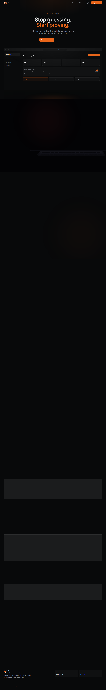
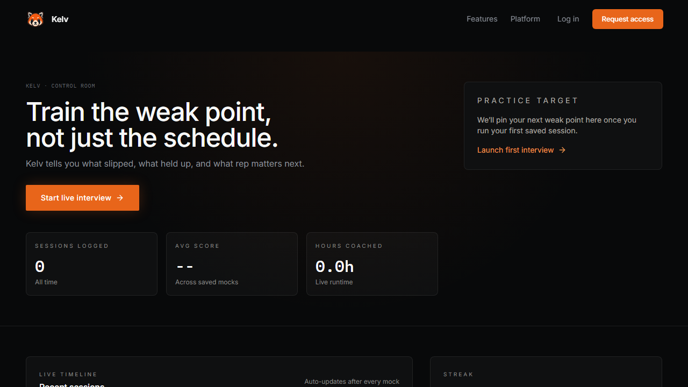
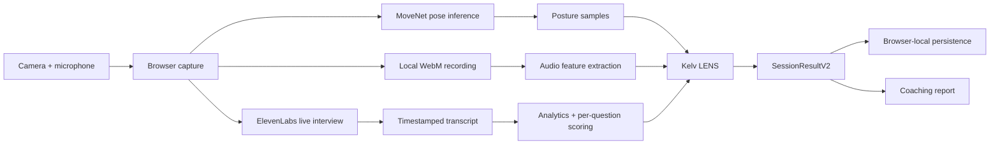
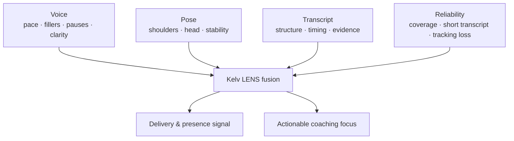

<p align="center">
  
</p>

<h1 align="center">Kelv AI</h1>

<p align="center">
  <strong>A browser-native, multimodal interview analysis runtime for practicing how you sound, structure an answer, and show up on camera.</strong>
</p>

<p align="center">
  <a href="https://www.youtube.com/watch?v=sv-mgria_6Q"><strong>Watch the product demo</strong></a>
  ·
  <a href="#quick-start"><strong>Run locally</strong></a>
  ·
  <a href="#signal-pipeline"><strong>Explore the signal pipeline</strong></a>
</p>

## Demo

<p align="center">
  <a href="https://www.youtube.com/watch?v=sv-mgria_6Q">
    
  </a>
</p>

> Before the open-source direction, Kelv attracted roughly **300 waitlist users**. This repository contains the working interview-practice product and its client-side intelligence runtime.

## Why we built Kelv

Kelv AI started as a senior-year capstone that my friends and I built after noticing a persistent problem in interview preparation: most tools either produced static question banks or gave generic feedback after the fact. Neither model captures the real constraint of an interview, where a candidate must retrieve evidence, organize it under pressure, communicate it clearly, and maintain a credible on-camera presence in the same short window.

We treated interview practice as a multimodal systems problem. Kelv coordinates a real-time voice interviewer with browser-resident capture, transcript-grounded scoring, and reliability-aware signal fusion. The goal was not to predict employability or infer personality. The goal was to make the evidence already present in a practice interview legible: where an answer lost structure, where delivery became unstable, and what the next deliberate rep should target.

## What Kelv does

Kelv runs a live mock interview, captures the evidence produced during it, and turns that evidence into a per-question coaching report. It is designed around a simple premise: a candidate’s answer quality and delivery are inseparable in a real interview.

- **Live interviewer:** ElevenLabs Agents runs the real-time voice conversation and receives role-, level-, résumé-, and job-description-aware runtime context.
- **On-device presence analysis:** MoveNet runs in the browser through TensorFlow.js + WebGL to derive posture signals from webcam frames—no video-analysis service is required for the active path.
- **Recording-backed voice analysis:** the browser captures a local WebM recording, then extracts audio features and combines them with transcript timing and lexical signals.
- **Question-level coaching:** transcripts are segmented into question/answer pairs and scored for content, delivery, and presence.
- **Local-first session results:** a normalized `SessionResultV2` payload, saved interview history, presets, and optional local session are persisted in browser storage—no database, RLS policy, or hosted auth service is required.

## Product surface

The dashboard is intentionally accessible at `/platform` without a hosted account or approval flow. It becomes a local control surface for starting a session, reviewing saved evidence, and tracking the next coaching target.

<p align="center">
  
  
</p>

## Signal pipeline



### Computer vision: posture

The active camera pipeline is deliberately constrained to explainable posture signals. During an interview, [`usePoseTracking`](./src/hooks/usePoseTracking.ts) samples the video stream every 10 seconds. [`poseDetector`](./src/utils/poseDetector.ts) initializes MoveNet SinglePose Lightning with TensorFlow.js/WebGL and derives:

| Signal | How it is derived | Result use |
| --- | --- | --- |
| Shoulder alignment | Angle between detected shoulder keypoints | Presence score and posture-drift coaching |
| Head centering | Nose/ear anchor relative to the shoulder midpoint | `centered`, `forward`, or `tilted` feedback |
| Torso lean | Shoulder midpoint relative to hip midpoint | “Good posture” eligibility |
| Landmark confidence | Mean confidence across relevant keypoints | Tracking-loss and coverage diagnostics |
| Time in good posture | Share of samples that meet the posture criteria | Presence stability and coaching |

The camera path is optional. If tracking is unavailable, Kelv labels the gap (`no_pose_samples` / `tracking_loss`) and lowers confidence instead of inventing a visual score. The active scoring path does **not** claim emotion recognition, personality inference, or hiring suitability.

### Voice analysis: recording features plus transcript evidence

Kelv records locally with `MediaRecorder` while the interview runs. On completion, [`enhancedSpeech`](./src/utils/enhancedSpeech.ts) decodes the captured audio with the Web Audio API and computes frame-level RMS energy, zero-crossing rate, pitch proxy, spectral-centroid proxy, and MFCC-like coefficients. The resulting metrics contribute to:

- pace and cadence;
- filler-word load;
- pause control and hesitation proxy;
- articulation and clarity proxies;
- fluency and vocal-variety proxies.

The transcript pipeline independently calculates answer length, response timing, STAR-language coverage, quantification, weak phrasing, and per-question evidence gaps. This means Kelv can still provide a constrained, transcript-based delivery report when a recording is unavailable; the report declares that fallback in its reliability flags.

### Kelv LENS: reliability-aware fusion

[`kelvLens`](./src/utils/kelvLens.ts) combines the voice and posture paths into a delivery/presence signal. It weights pace, filler control, pause control, articulation, clarity, fluency, vocal variety, posture, shoulder alignment, head centering, and visual stability. The output carries:

- signal provenance (`recording_blob` or `transcript_proxy`);
- sample count, sample coverage, and tracking-loss rate;
- explicit reliability flags;
- a conservative reliability weight before the final delivery/presence score;
- a short list of concrete coaching actions.



### Research directions: multi-view vision and higher-fidelity audio

The shipped system uses one browser camera and the device microphone because that configuration was practical within the capstone timeline. We also designed, but did not implement, two extensions intended to reduce the ambiguity inherent in a single front-facing webcam.

**Multi-view posture reconstruction.** The planned capture topology adds two external cameras at offset viewpoints. A future implementation would timestamp all streams against a shared clock, estimate each camera's intrinsic parameters, solve the inter-camera extrinsics, and associate pose keypoints across views. Matched 2D landmarks could then be triangulated into a 3D skeletal estimate. This would make shoulder roll, torso rotation, asymmetric lean, and out-of-plane head movement more observable than they are from a single monocular projection. Any multi-view score would still need confidence gating for occlusion, dropped frames, calibration drift, and cross-camera landmark disagreement.

**Spectral audio instrumentation.** We also considered higher-fidelity microphones or multi-microphone interfaces with calibrated frequency response, higher signal-to-noise ratio, and stable sampling clocks. Rather than treating a microphone as a simple waveform source, a future audio path could maintain multi-band spectral energy, spectral roll-off, harmonicity, voiced/unvoiced segmentation, and room-noise estimates over aligned speech windows. Those features could improve robustness for pause detection, articulation proxies, pitch-variation estimates, and reliability labeling in noisy rooms. This work was deliberately deferred rather than approximated with unsupported claims.

These are architectural directions, not completed features. Kelv remains a useful local prototype today, and the data contracts are intended to leave room for future sensor provenance, calibration metadata, and multi-stream confidence fields.

## Product flow

1. Open `/platform` directly; signing in is optional and local-only.
2. Add a résumé file and target job description so the interviewer can build role-aware runtime context.
3. Permit microphone/camera access and start the ElevenLabs interviewer.
4. Kelv captures the transcript, local recording, and optional pose samples as the conversation progresses.
5. End the interview. The processing step normalizes the session, scores answers, creates LENS signals, and builds a practice plan.
6. Review overall, per-question, delivery, and presence feedback; reopen saved sessions from history.

## Architecture

| Layer | Responsibility | Key code |
| --- | --- | --- |
| React/Vite client | Product UI, capture, scoring, results | `src/` |
| ElevenLabs Agents | Live conversation, transcript events, prompt override, whiteboard client tools | `useElevenLabsInterview.ts` |
| Browser CV | MoveNet posture landmarks via TensorFlow.js/WebGL | `poseDetector.ts`, `usePoseTracking.ts` |
| Browser audio | MediaRecorder capture and Web Audio feature extraction | `VoiceInterviewSession.tsx`, `enhancedSpeech.ts` |
| Intelligence | Transcript analytics, question scoring, practice planning, reliability fusion | `analyticsEngine.ts`, `perQuestionAnalytics.ts`, `kelvLens.ts` |
| Persistence | Browser-local session, saved setups, history, and result payloads | `local-interview.ts` |

## Quick start

### Prerequisites

- Node.js 20+ and npm
- An ElevenLabs account and agent ID for live voice interviews
- A modern Chromium-based browser with microphone and camera permissions for the full experience

### 1. Install dependencies

```bash
npm install
```

### 2. Configure environment variables

Copy `.env.example` to `.env.local`, then supply the values you need:

```bash
# Used only by the agent-setup script; never prefix this key with VITE_.
ELEVENLABS_API_KEY=your_private_elevenlabs_api_key

# Safe for the browser when your ElevenLabs agent is configured for the intended access model.
VITE_ELEVENLABS_AGENT_ID=your_elevenlabs_agent_id

# Demo-only legacy feedback path. Do not use a browser-exposed API key in production.
VITE_OPENAI_API_KEY=your_openai_api_key
```

### 3. Provision the ElevenLabs interviewer (optional if you already have an ID)

```bash
npm run setup:elevenlabs-agent
```

The script creates or repairs the Kelv agent configuration and registers client tools used for whiteboard-oriented reasoning.

### 4. Start the app

```bash
npm run dev
```

Vite serves the app at `http://localhost:5173` by default.

## Local runtime model

Kelv has no backend requirement. `/platform` is public and usable immediately; `/login` is an optional local identity surface that writes a display-only profile into `localStorage`. There is no remote authentication, user table, row-level security policy, database migration, or server-side session.

| Browser key | Payload |
| --- | --- |
| `kelv-local-session` | Optional local display identity |
| `kelv-saved-interview-setups` | Saved role/interview presets |
| `kelv-interview-history` | Compact history entries for the dashboard |
| `kelv-platform-results` | Full normalized results for reopening reports |

This is intentionally a single-device model. Clearing site data clears local history and presets. The only required network dependency for a live voice interview is ElevenLabs; all posture, recording, feature extraction, scoring, and persistence occur in the browser.

## Commands

| Command | Purpose |
| --- | --- |
| `npm run dev` | Start Vite through Kelv’s development wrapper |
| `npm test` | Run the Vitest suite |
| `npm run test:e2e` | Run Playwright checks for public platform access, navigation, local sign-in, and pre-session launch |
| `npm run test:prompts` | Run prompt/context regression tests |
| `npm run setup:elevenlabs-agent` | Create or update the ElevenLabs agent configuration |

## Data handling and limitations

- Camera pose inference, audio feature extraction, scoring, and persistence are performed in the browser for the active pipeline.
- `/platform` is intentionally unprotected and works without signing in. Login is a local convenience session, not an access-control boundary.
- Browser capture quality, lighting, framing, microphone quality, and short answers affect signal reliability. Kelv surfaces those limitations in the result payload instead of silently treating all signals as equally trustworthy.
- Kelv is an interview-practice and coaching tool. Its signals are not employment decisions, biometric identification, personality assessment, or a substitute for human judgment.
- `VITE_OPENAI_API_KEY` remains a demo-only legacy path. Move feedback generation behind an authenticated server boundary before any production deployment.

## Testing

```bash
npm test
npm run test:e2e
```

The unit suite covers analytics, prompt construction, Kelv LENS fusion, per-question scoring, practice-plan progress, session normalization/validation, and deterministic benchmark fixtures. The Playwright suite verifies that the direct local platform, homepage navigation, local sign-in route, and session-launch surface work in a real browser.

## Repository guide

```text
src/
  components/Platform/     interview setup, live session, processing, reports
  hooks/                   ElevenLabs, pose tracking, recording helpers
  utils/                   analytics, CV, voice, prompt, persistence, validation
  types/                   interview and normalized session contracts
scripts/                   local dev and ElevenLabs agent setup
public/                    brand and web assets
```

## Open-source readiness

This is a working product repository, not a claim that every prototype dependency is production-ready. Before publishing a multi-user deployment, introduce a real identity boundary, server-side secret handling, encrypted persistence, retention controls, and measured evaluation thresholds for scoring quality and fairness.
