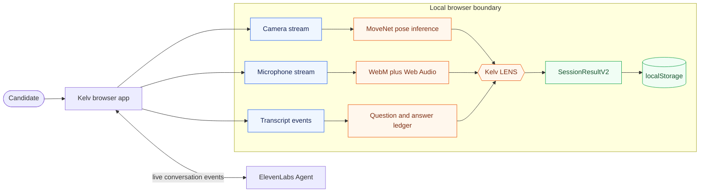
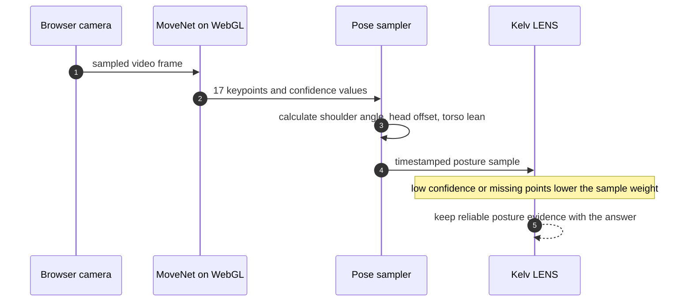
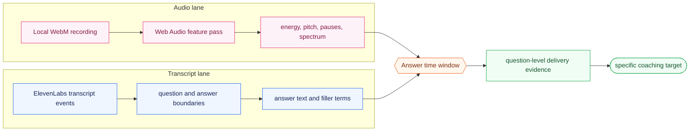

<p align="center"></p>

<h1 align="center">Kelv AI</h1>

<p align="center"><strong>A browser-first interview practice system that turns a live conversation into question-level feedback on content, delivery, and posture.</strong></p>

<p align="center"><a href="https://www.youtube.com/watch?v=sv-mgria_6Q"><strong>Watch demo</strong></a> &middot; <a href="#run"><strong>Run locally</strong></a> &middot; <a href="#how-it-works"><strong>How it works</strong></a></p>

> Kelv started as a senior-year capstone built by my friends and me. Before we started thinking about open source, it had roughly **300 people on the waitlist**.

## What it is

Interview prep usually gives you a question list or generic feedback after the fact. We wanted to make the practice session itself useful: run a real conversation, keep the evidence attached to each answer, and show the person exactly what to work on next.

- ElevenLabs Agents handles the live interviewer.
- The browser captures webcam and microphone input with user permission.
- Kelv builds a local `SessionResultV2` with per-question scores, supporting signals, and a practical next rep.

## Product

### Dashboard

`/platform` is deliberately open in local mode. There is no hosted login, Supabase project, or row-level-security setup required to try the product.


### Setup

Before the interview, the user adds job context and grants camera/microphone access. The same browser session owns the capture stream and the local recovery state.


### Review

The review keeps the question, answer, signal quality, and coaching together. That makes a weak score debuggable instead of feeling like a black-box verdict.


## How it works



**Why browser-first:** interview video and audio are personal, and a capstone did not need a database to prove the feedback loop. The tradeoff is intentional: saved sessions stay in the browser profile that created them instead of following the user across devices.

## Vision



- **Frame to landmarks.** The camera gives MoveNet a sampled frame. MoveNet runs through TensorFlow.js and WebGL in the browser, then returns 17 body landmarks with a confidence value for each point.
- **Landmarks to posture.** `poseDetector` does not score the image directly. It turns those points into geometry: the shoulder line angle, head offset from the torso center, and torso lean.
- **Posture to feedback.** `usePoseTracking` sends timestamped samples to LENS. A blurry frame, occluded shoulder, or weak landmark confidence reduces the weight of that sample instead of creating a confident-sounding coaching claim.

## Voice



- **Audio lane.** The local WebM recording is decoded with the Web Audio API. This is where the system measures timing and acoustics: speech rate, silence, RMS energy, pitch contour, and spectral shape.
- **Transcript lane.** ElevenLabs events tell Kelv what was said and when. That lets the system find the start and end of each answer, count filler terms, and avoid mixing one answer's delivery with the next question.
- **Answer window.** The two lanes meet on the same time range. A long pause only becomes useful feedback once Kelv knows which answer it happened in and whether the recording quality was good enough to trust it.

## Scoring

`Kelv LENS` is a reliability-aware fusion step, not a model that guesses whether somebody is employable.

- It aligns content, voice, and posture evidence to a question/answer pair.
- It records weak capture conditions instead of treating every signal as equally trustworthy.
- It returns scores with the evidence that produced them, then picks one concrete practice target for the next session.

## Future plans

We had a few things we wanted to try but could not fit into the capstone timeline.

- **More camera angles.** The idea was to pair the laptop camera with two external cameras, compare pose landmarks across views, and use cross-view confidence to reduce occlusion problems.
- **Better audio.** We also wanted to test an external or spectral microphone. Cleaner source audio would make prosody and spectral measurements more stable than a laptop mic can make them.
- **Face and eye prototypes.** There is exploratory code in the repo, but it is not in the active scoring path. We would only bring it back if it produced specific, explainable coaching—not a vague emotion label.

## Run

**You need:** Node.js 20+, a Chromium-based browser, and an ElevenLabs Agent ID for live voice interviews.

```bash
npm install
cp .env.example .env
# add VITE_ELEVENLABS_AGENT_ID to .env
npm run dev
```

Open `http://localhost:5173/platform`.

| Command | Use |
| --- | --- |
| `npm run dev` | Start the local platform. |
| `npm test` | Run unit tests. |
| `npm run test:e2e` | Run browser tests. |
| `npm run capture:readme` | Regenerate README screenshots. |
| `npm run test:prompts` | Test prompt and context composition. |
| `npm run setup:elevenlabs-agent` | Set up the ElevenLabs Agent. |
