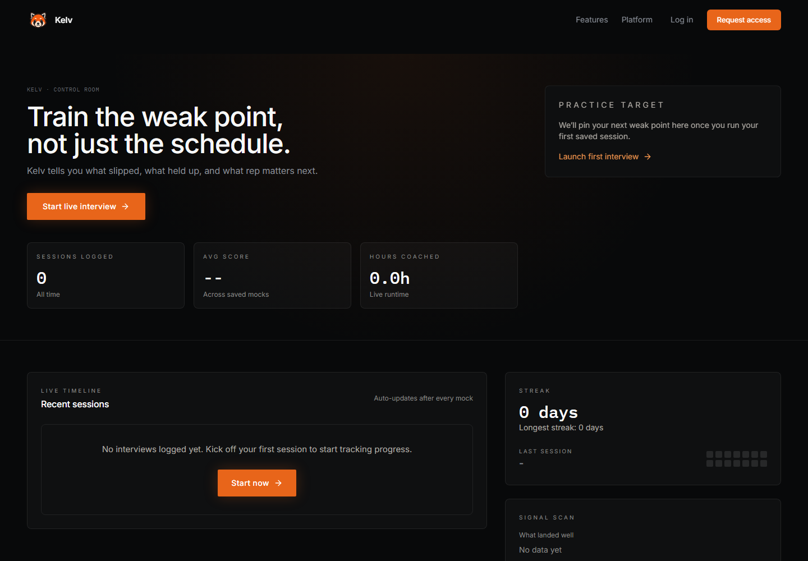
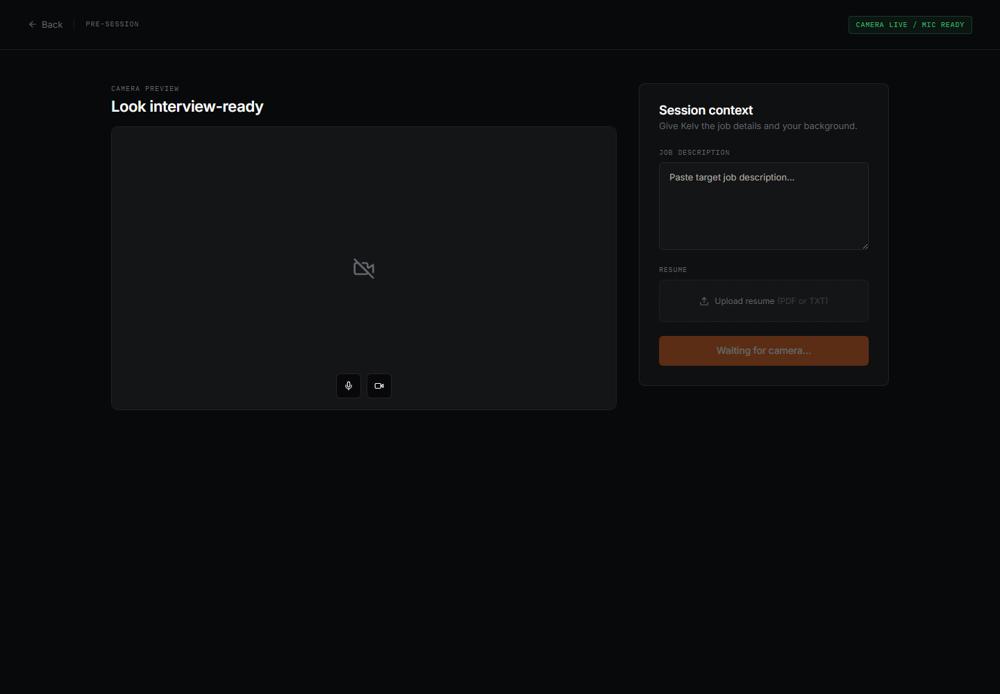
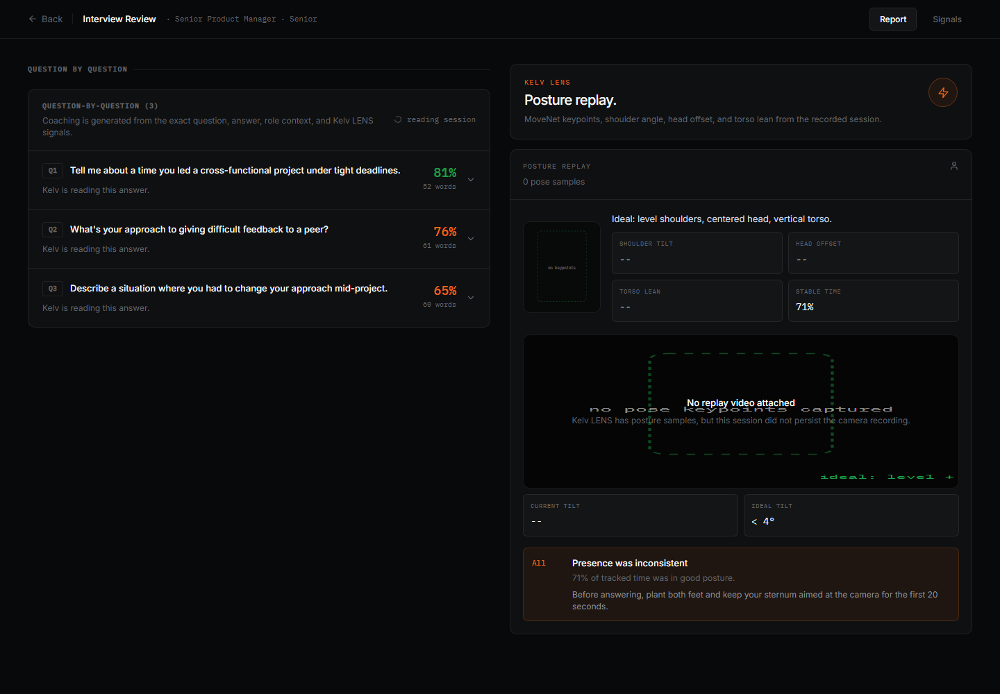
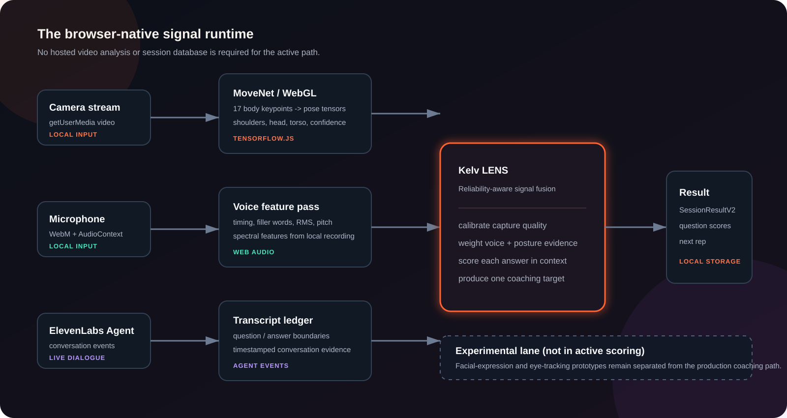
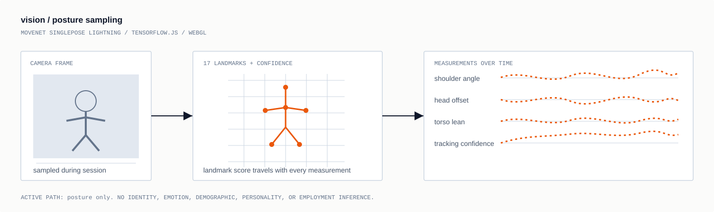
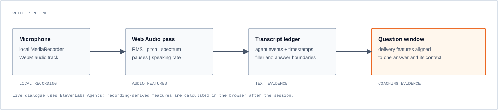

<p align="center"></p>

<h1 align="center">Kelv AI</h1>

<p align="center"><strong>Browser-native interview practice with voice, posture, and question-level coaching.</strong></p>

<p align="center"><a href="https://www.youtube.com/watch?v=sv-mgria_6Q"><strong>Watch demo</strong></a> &middot; <a href="#run"><strong>Run locally</strong></a> &middot; <a href="#vision"><strong>Vision pipeline</strong></a></p>

> Built as a senior-year capstone. Kelv attracted roughly **300 waitlist users** before we explored open sourcing it.

## Why Kelv

Interview practice is more than answering a question correctly. Kelv helps a candidate inspect answer structure, delivery, and visible posture from the same practice session.

- Live ElevenLabs interviewer with role-aware context
- Browser-local camera and microphone capture
- Per-question coaching instead of one opaque score

## Product

### Dashboard

Direct local access at `/platform`; no hosted auth, Supabase project, or database policy is required.



### Setup

Role context, job description, resume input, and capture checks are prepared before the interview begins.



### Review

Results keep the evidence tied to each question and surface posture feedback beside the transcript-led review.



## Runtime



- Camera, microphone, and live-agent events are collected in the browser.
- Kelv LENS checks signal quality, aligns evidence to each question, and weights available signals.
- `SessionResultV2`, saved sessions, and presets are persisted in browser-local storage.

## Vision



- TensorFlow.js + WebGL run MoveNet SinglePose Lightning in the active camera path.
- `usePoseTracking` samples the webcam; `poseDetector` derives shoulder alignment, head offset, torso lean, stability, and detector confidence.
- Active scoring uses posture only: no identity, emotion, demographic, personality, or employment inference.

## Voice



- ElevenLabs Agents supplies live dialogue and transcript events.
- A browser-local WebM recording and Web Audio pass provide pace, pauses, filler usage, RMS energy, pitch, and spectral features.
- Features are aligned with question and answer boundaries before coaching is generated.

## Future plans

We had a few things we wanted to try but did not have time to build into the capstone.

- **More camera angles.** We wanted to pair the laptop camera with two external cameras so we could compare body position from different angles instead of guessing through occlusion.
- **Better audio input.** We also talked about using an external or spectral microphone so voice features would start with cleaner audio than a laptop mic can give us.
- **Face and eye prototypes.** There is exploratory code for these in the repo, but it is not part of the live scoring flow and we would only bring it back with clear, useful coaching use cases.

## Run

**Requirements:** Node.js 20+, a Chromium-based browser, and an ElevenLabs Agent ID for live voice interviews.

```bash
npm install
cp .env.example .env
# add VITE_ELEVENLABS_AGENT_ID to .env
npm run dev
```

Open `http://localhost:5173/platform`.

| Command | Use |
| --- | --- |
| `npm run dev` | Start the local platform. |
| `npm test` | Run unit tests. |
| `npm run test:e2e` | Run browser tests. |
| `npm run capture:readme` | Regenerate README screenshots. |
| `npm run test:prompts` | Test prompt/context composition. |
| `npm run setup:elevenlabs-agent` | Set up the ElevenLabs Agent. |
